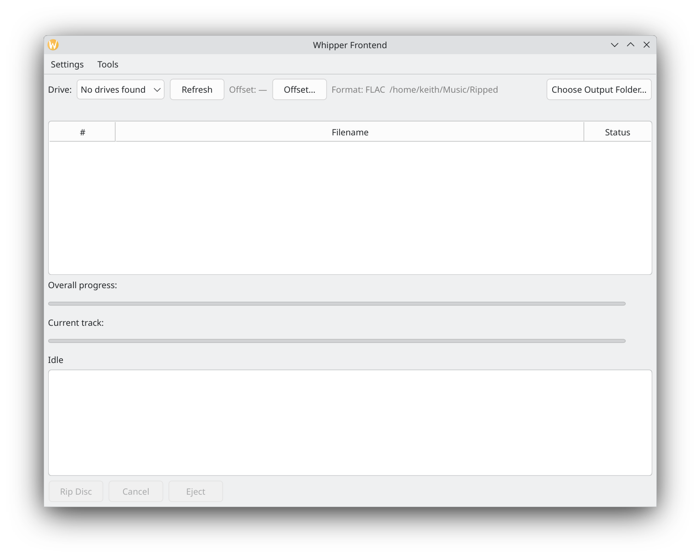

# Whipper Frontend

**A graphical interface (GUI) for [whipper](https://github.com/whipper-team/whipper),
the accurate CD ripper for Linux.** Whipper Frontend is a free, open-source
Qt (PySide6) app for secure, AccurateRip-verified CD ripping to FLAC, an
alternative to Exact Audio Copy (EAC) and XLD for Linux users who would
rather not use the command line.

Rip a disc with live progress bars, find your drive's read offset, name files
with custom templates, fetch cover art, and verify the rip log, all from one
window. Runs on Debian, Ubuntu, Linux Mint, KDE Plasma, GNOME and other
Linux desktops.



[**Download the latest .deb**](https://github.com/keithhanlon/whipper-frontend/releases/latest)
· [Report a bug](https://github.com/keithhanlon/whipper-frontend/issues)

Whipper Frontend wraps whipper's own command-line interface via subprocess.
It never imports whipper's internals, so it stays compatible across whipper
version bumps rather than depending on an unstable internal API.

## Features

- Drive detection and read-offset determination (wraps `whipper drive
  analyze` / `whipper offset find`), with the confirmed offset stored in
  whipper's own config.
- Rip a disc with live dual progress bars (overall disc + current track),
  a live track table, and album info — all parsed from whipper's own
  real-time output.
- Custom track/disc file naming templates, with live validation against
  whipper's actual template rules.
- Cover art fetching (save to file, embed in FLAC, or both).
- Optional filename sanitization for VFAT/exFAT/Windows-formatted drives
  and network shares.
- "Keep ripping if one track fails" and "rip even if metadata isn't
  found" options for damaged or obscure discs.
- Configurable max retries per track (whipper's default is 5; set to 0 for
  infinite) for stubborn or scratched discs.
- Eject button, and an optional auto-eject-when-finished setting that also
  plays your desktop's alert sound when the rip completes.
- Rip log verification via [OPSnet's logchecker](https://github.com/OPSnet/Logchecker)
  (the same tool used by private trackers such as Orpheus) — runs
  automatically after each rip if configured, with color-coded results.

## Requirements

- Linux, with a desktop environment (developed primarily on KDE Plasma)
- [whipper](https://github.com/whipper-team/whipper) installed and on `PATH`
- Python 3.10+ and PySide6 (see Setup below for two ways to get this)
- Optional: PHP (`php-cli`) and
  [logchecker.phar](https://github.com/OPSnet/Logchecker/releases) for log
  verification

## Setup

### Option A: Debian package (recommended on Debian/Ubuntu-based systems)

Download the `.deb` from the
[Releases page](https://github.com/keithhanlon/whipper-frontend/releases/latest)
and install it:

```bash
sudo apt install ./whipper-frontend_<version>_all.deb
```

This pulls in `whipper`, the system PySide6 packages, and all other
dependencies automatically, so no virtual environment is needed. The app is
then available as `whipper-frontend` on your `PATH` and in your application
menu.

To build the package yourself from source instead:

```bash
sudo apt install debhelper dh-python
dpkg-buildpackage -us -uc -b
```

This produces `../whipper-frontend_<version>_all.deb` in the parent
directory.

### Option B: Run from source

```bash
python3 -m venv venv
source venv/bin/activate
pip install -r requirements.txt
python3 main.py
```

## Project layout

```
main.py                     Entry point when run from source
requirements.txt
debian/                     .deb packaging (control, rules, desktop entry, icon)
whippergui/
  app.py                    QApplication bootstrap, checks whipper is on PATH
  main_window.py            Main window: drive picker, track table, controls
  rip_worker.py             QThread wrapping the `whipper cd rip` subprocess
  offset_dialog.py          Drive read-offset determination UI
  offset_worker.py          QThread wrapping `whipper drive analyze`/`offset find`
  offset_utils.py           Reads whipper's own config for stored offsets
  device_utils.py           Optical drive detection
  settings.py               Persisted app settings (QSettings)
  settings_dialog.py        Tabbed Settings window
  sound.py                  Desktop alert sound on completion
  templates_dialog.py       Track/disc naming template editor
  whipper_config.py         Reads/writes whipper's own config file
  log_verify.py             Runs and parses OPSnet's logchecker
  log_verify_dialog.py      Log verification results window
```

## License

GPLv3 — see [LICENSE](LICENSE). This project wraps whipper (also GPLv3) via
subprocess rather than linking against it, but is released under the same
license as a courtesy, given its purpose.
